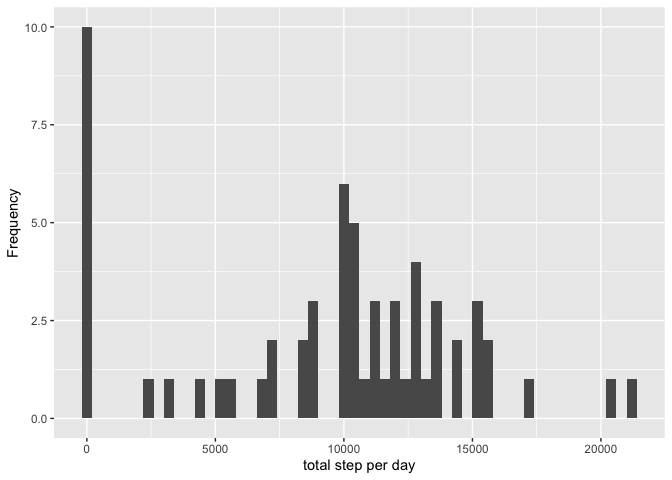
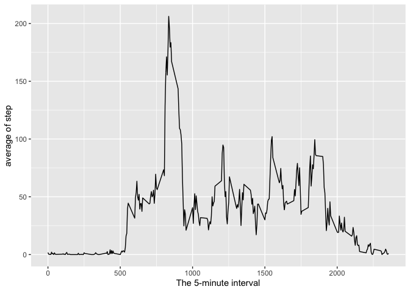
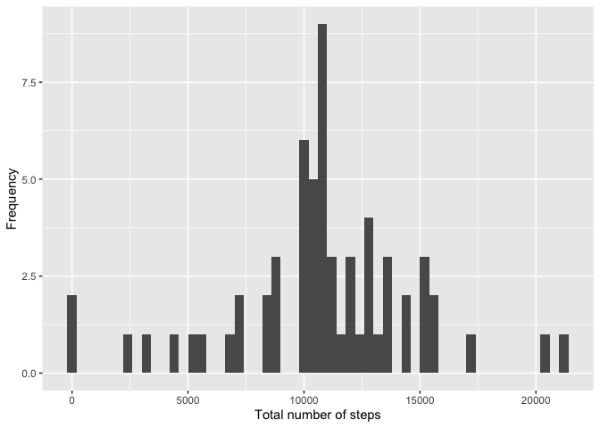
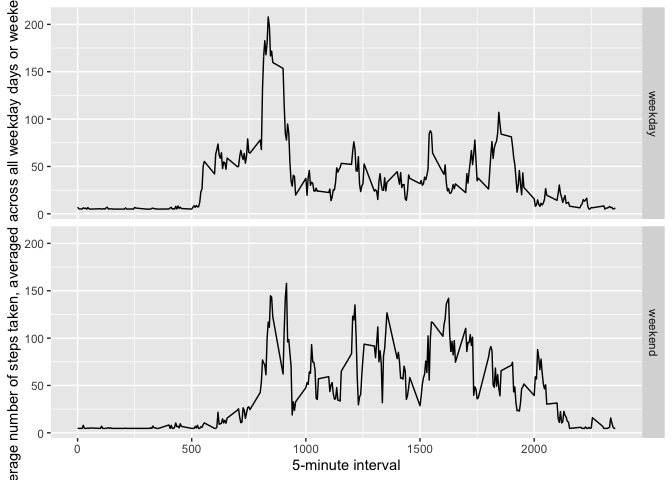

# Reproducible research Week-2 : Peer Assessment 1

## Loading and preprocessing the data

``` r
data <- read.csv("activity.csv")
```

## What is mean total number of steps taken per day?

``` r
step_Day <- tapply(data$steps, data$date, sum, na.rm=TRUE)
qplot(step_Day, xlab='total step per day', ylab='Frequency', binwidth=400)
```

<!-- -->

``` r
step_Mean <- mean(step_Day)
step_Median <- median(step_Day)
```

Mean: 9354.2295082 , Median:
10395

## What is the average daily activity pattern?

``` r
average_step <- aggregate(x=list(mean_step=data$step), by=list(interval=data$interval), FUN=mean, na.rm=TRUE)
```

``` r
ggplot(data=average_step, aes(x=interval, y=mean_step)) + geom_line() + xlab("The 5-minute interval") + ylab("average of step") 
```

<!-- -->

``` r
average_step[which.max(average_step$mean_step), ]
```

    ##     interval mean_step
    ## 104      835  206.1698

## Imputing missing values

``` r
num_missingvalue <- length(which(is.na(data$steps)))
```

Number of missing value: 2304

#### Create a new dataset

``` r
data_impute <- data
data_impute$steps <- impute(data$steps, fun=mean)
```

``` r
step_Dayimpute <- tapply(data_impute$steps, data_impute$date, sum)
qplot(step_Dayimpute, xlab='Total number of steps', ylab='Frequency', binwidth=400)
```

<!-- -->

``` r
step_MeanDayimpute <- mean(step_Dayimpute)
step_MedianDayimpute <- median(step_Dayimpute)
```

Mean\_impute: 1.076618910^{4} , Median\_impute:
1.076618910^{4}

## Are there differences in activity patterns between weekdays and weekends?

#### Create a new factor variable in the dataset

``` r
data_impute$dateType <-  ifelse(as.POSIXlt(data_impute$date)$wday %in% c(0,6), 'weekend', 'weekday')
```

``` r
averagedata_impute <- aggregate(steps ~ interval + dateType, data=data_impute, mean)
ggplot(averagedata_impute, aes(interval, steps)) + 
    geom_line() + 
    facet_grid(dateType ~ .) +
    xlab("5-minute interval") + 
    ylab("average number of steps taken, averaged across all weekday days or weekend days")
```

<!-- -->
